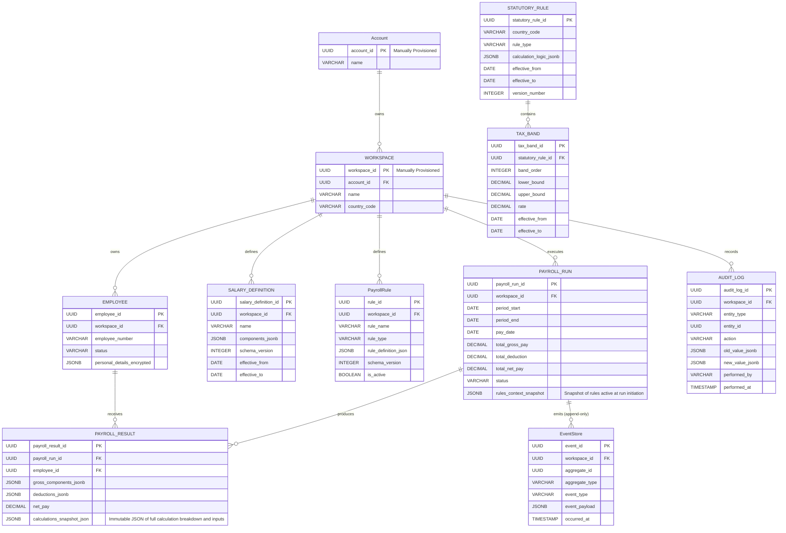
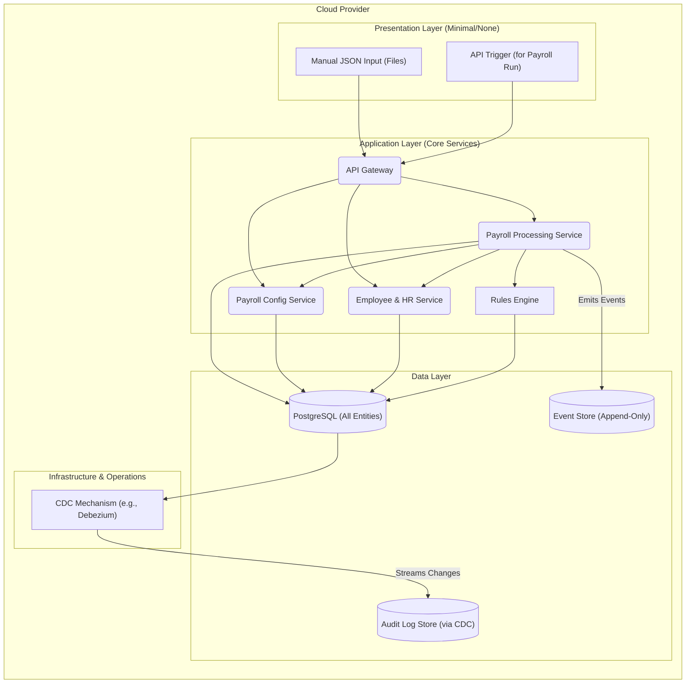

# Phase 1: Visual Architecture for Nigerian Payroll Platform MVP

This document provides the Entity Relationship Diagram (ERD) and the High-Level Architectural Diagram specifically tailored for Phase 1 of the payroll platform roadmap. These diagrams highlight the minimal viable product (MVP) scope, focusing on a single client, manual JSON ingestion, and foundational backend services.

## 1. Phase 1 Entity Relationship Diagram (ERD)

The Phase 1 ERD illustrates the core entities required for the initial MVP. It emphasizes the manual provisioning of `Account` and `WORKSPACE` and the direct population of `EMPLOYEE`, `SALARY_DEFINITION`, `STATUTORY_RULE`, `TAX_BAND`, and `PayrollRule` via JSON. The `PAYROLL_RUN` includes the `rules_context_snapshot` for compliance, and `PAYROLL_RESULT` captures the immutable calculation breakdown. The `EventStore` is present as an append-only log, and `AUDIT_LOG` captures changes via CDC.

## 2. Phase 1 High-Level Architectural Diagram

This diagram illustrates the streamlined architecture for the MVP. It focuses on the core backend services, manual data input, and the foundational data stores. The Event Bus and advanced microservices are intentionally omitted or simplified to reflect the initial scope.

