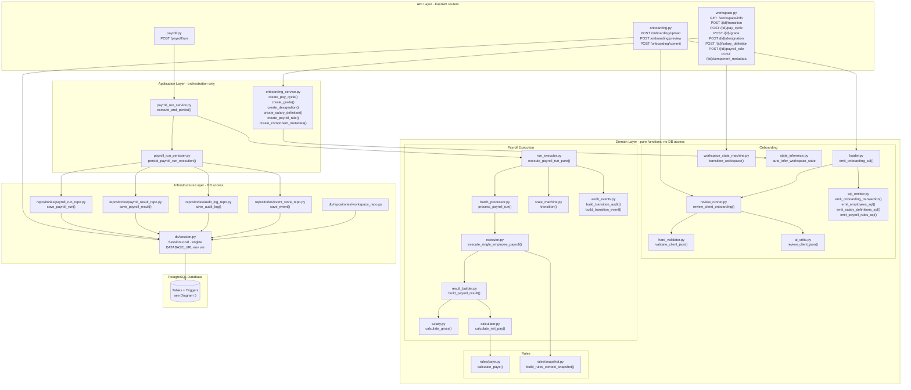
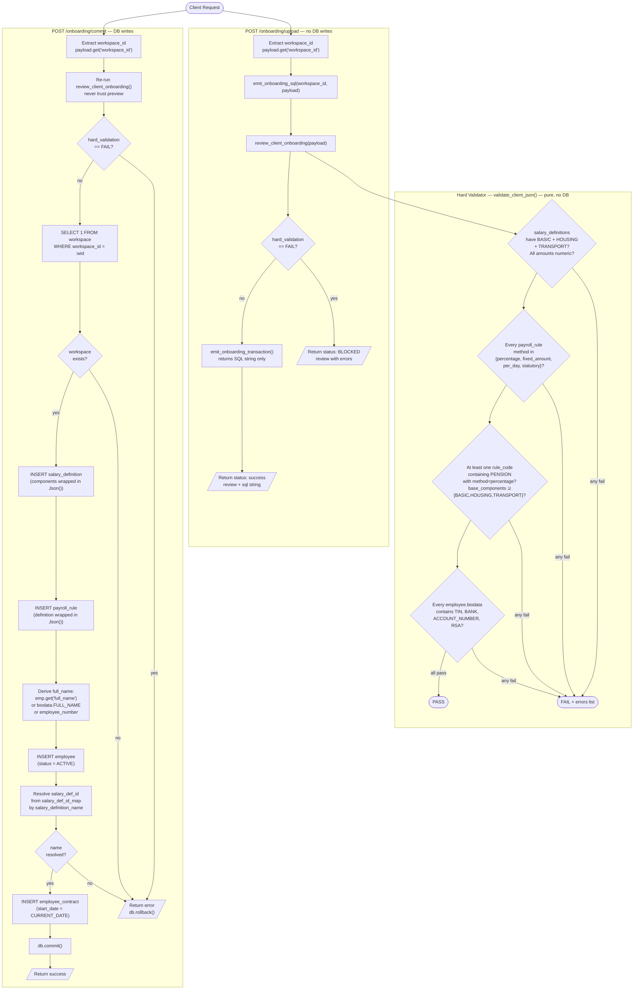
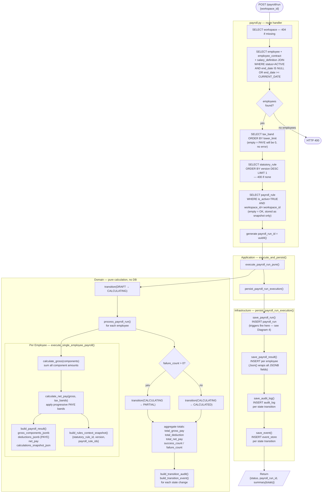
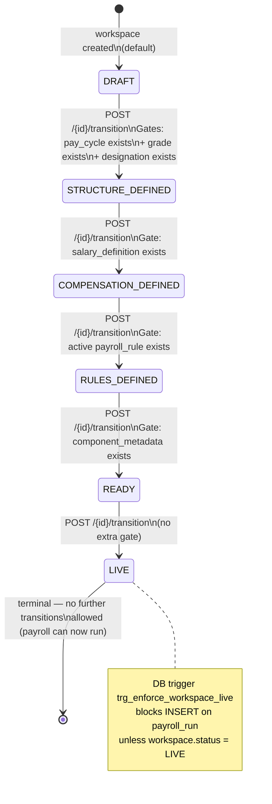
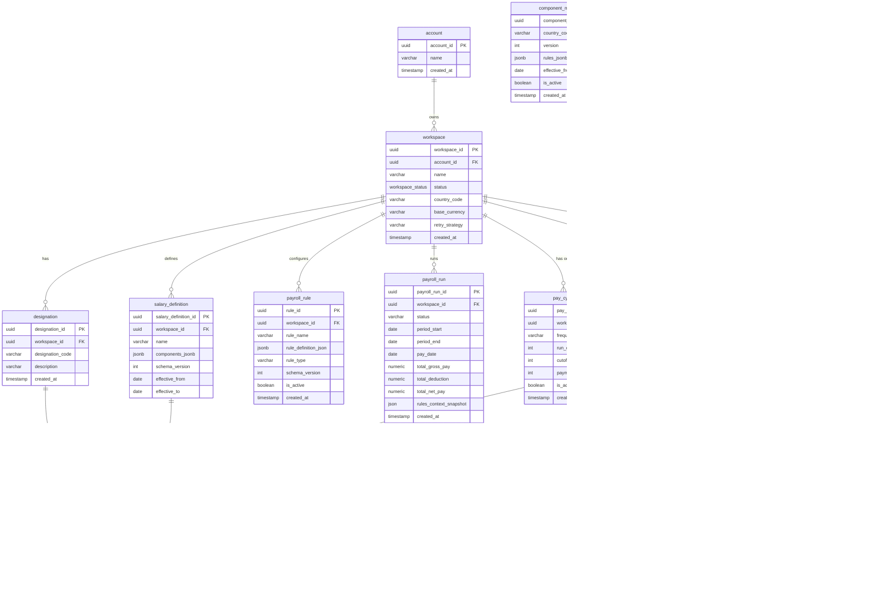
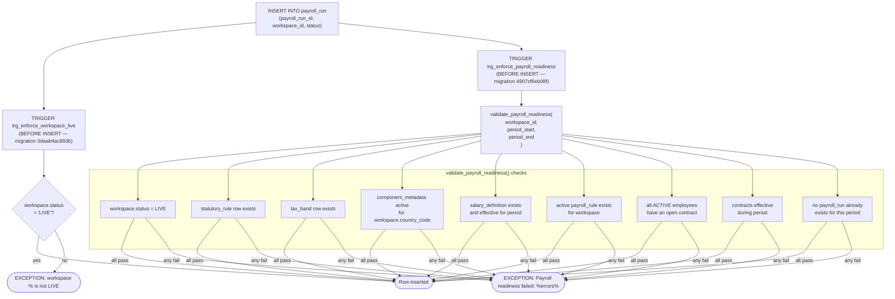

# Payroll Engine Architecture — Phase 1

Five diagrams derived directly from the codebase.
No inferred or aspirational detail.

---

## 1. System Layer Architecture

---

## 2. Onboarding Pipeline

---

## 3. Payroll Execution Pipeline

---

## 4. State Machines

### 4a — Workspace Lifecycle

### 4b — Payroll Run Lifecycle

```mermaid
stateDiagram-v2
    [*] --> DRAFT : execute_payroll_run_pure()\ncalled with new payroll_run_id

    DRAFT --> CALCULATING : transition()\nbefore batch processing

    CALCULATING --> CALCULATED : transition()\nfailure_count == 0

    CALCULATING --> PARTIAL : transition()\nfailure_count > 0\n(isolated mode only;\natomic mode raises immediately)

    PARTIAL --> CALCULATED : future manual resolution\n(defined in state_machine.py,\nnot yet exposed via API)

    CALCULATED --> APPROVED : future approval step\n(defined in state_machine.py)

    APPROVED --> LOCKED : future lock step\n(defined in state_machine.py)

    LOCKED --> [*] : terminal — immutable\nMigrations enforce\nno updates after LOCKED

    note right of CALCULATED
        Status value saved on
        payroll_run.status via
        save_payroll_run() INSERT
    end note
```

---

## 5. Database Schema

---

## 6. DB Triggers on `payroll_run` INSERT

