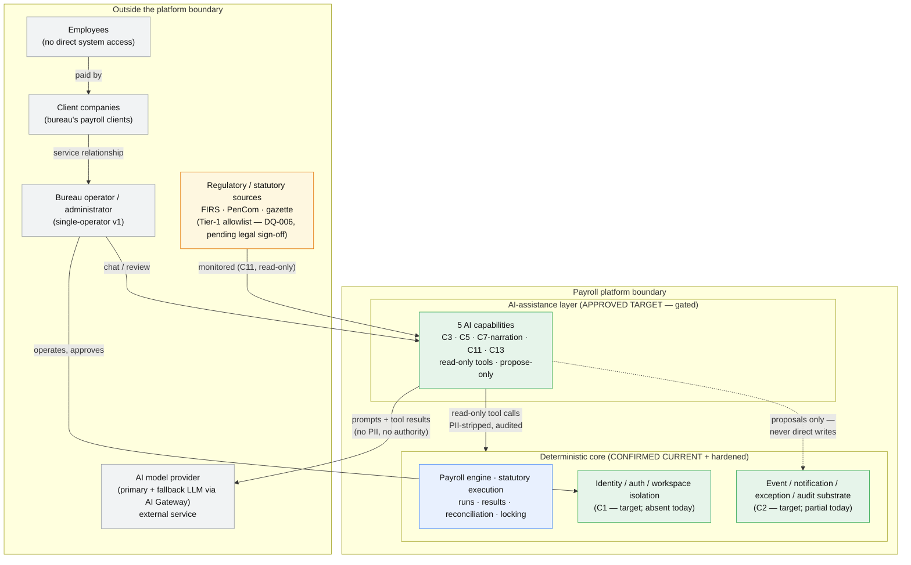
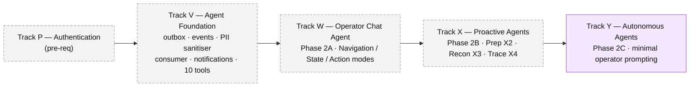
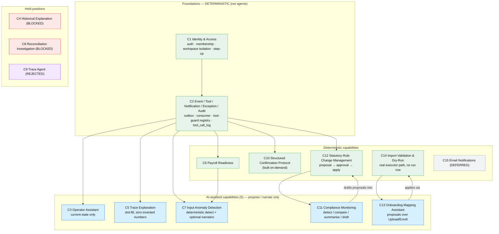
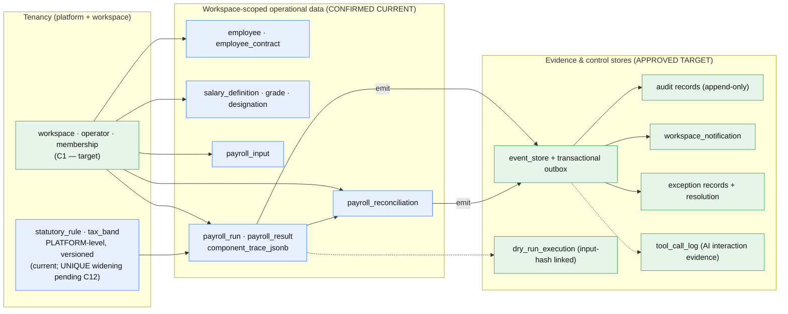
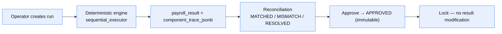
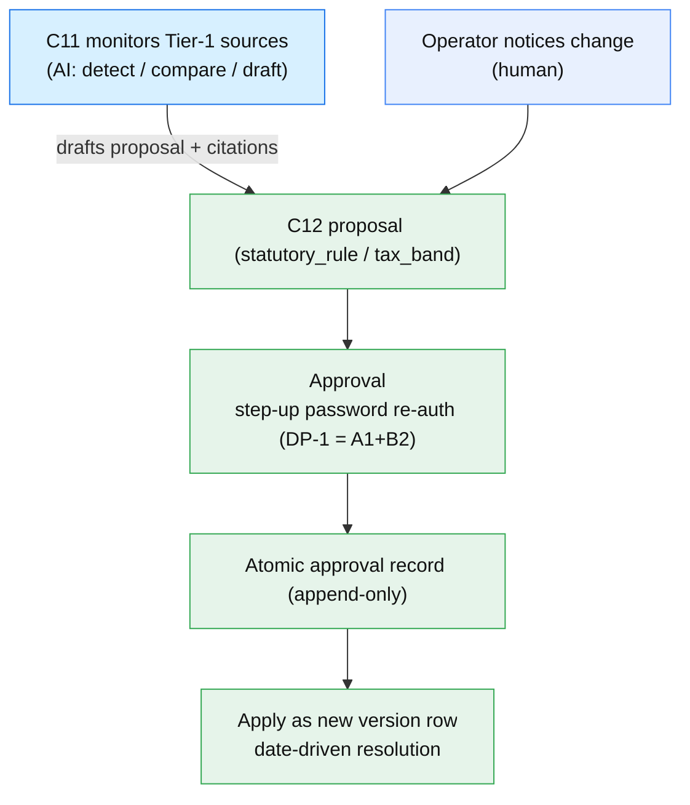
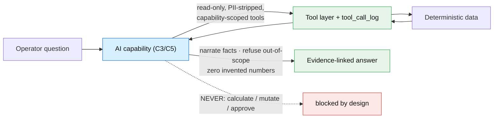
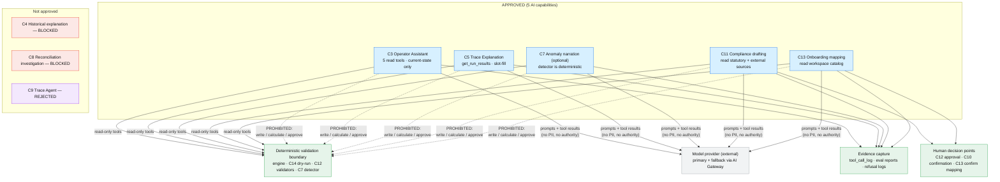
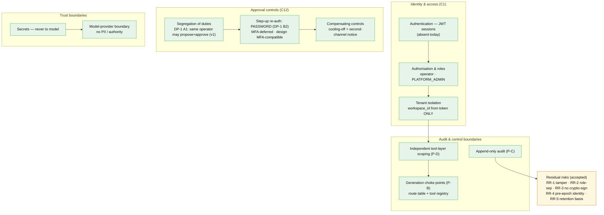

# Architecture Baseline Pack — Agentic Payroll Platform

**Programme**: Agentic Architecture Review · **Stage**: 13 (Approved Roadmap) · **Produced**: 2026-07-19
**Status of this pack**: consolidated reviewer artifact — synthesis only, invents no new architecture. **Stage 13 is OPEN (`awaiting-human-decision`); Phase 1 is NOT complete.**

This pack consolidates the Stage 08–13 outputs, the existing architecture document, the programme's confirmed findings, decisions, capability maps and roadmap into one navigable reference so a reviewer can compare **current** vs **target** without opening every stage file. Every claim traces to a cited source; nothing here is a new design or a new decision.

---

## 0. How to read this pack

### Status legend (used on every diagram and table)

| Label | Meaning |
|---|---|
| **CONFIRMED CURRENT** | Verified to exist in the codebase today (confirmed programme finding) |
| **APPROVED TARGET** | Approved direction (Stage 12 outputs; direction approval is DP-9-gated but the *content* is settled synthesis) |
| **PROPOSED** | In the roadmap but **not finally approved** — DP-9 pending |
| **PENDING** | Awaiting a human decision at this touchpoint (DP-2, DP-9) |
| **BLOCKED** | Disposition = blocked until named preconditions close |
| **REJECTED** | Disposition = rejected, permanently |
| **DEFERRED** | Disposition = deferred to a later increment |
| **ASSUMPTION / EVIDENCE-GAP** | Not established by evidence; flagged, never presented as fact |

Mermaid diagrams colour nodes by status: blue = current, green = approved target, amber = proposed/pending, red = blocked, purple = rejected, grey = deferred.

### Two decisions are still open (do not read this pack as closure)

- **DP-2 (source-document disposition) — PENDING** (`_core/HUMAN-DECISIONS.md` HD-9). `docs/architecture/agent-layer-architecture.html` and its frontend mirror are **NOT** superseded or retired. View L is a *recommendation only*.
- **DP-9 (final roadmap approval) — PENDING** (HD-16). The roadmap in views J/K is the **proposed** sequence, not finally approved. Approval closes Phase 1; that has not happened.

### DP-7 amendment applies to all evidence/onboarding views

Per **HD-14 (DP-7)**, onboarding baselines B1/B2 are captured via a **controlled onboarding benchmark** (representative historical or appropriately synthetic data, measured consistently against the manual process), with live-onboarding evidence collected opportunistically. Simulated onboarding is **controlled-benchmark evidence — never proof of live operational performance**. This supersedes the earlier "unrecoverable live window (W2)" framing wherever it appears in cited sources.

### Decisions recorded at this touchpoint (2026-07-19)

DP-1 = **A1 + B2** (HD-8) · DP-3 single-bureau/SaaS-ready (HD-10) · DP-4 advisory engagement approved to initiate (HD-11) · DP-5 RR-1 noted/accepted (HD-12) · DP-6 DEC-08-09 noted (HD-13) · DP-7 EG-004 amended (HD-14) · DP-8 EG-005 approach approved (HD-15). DP-2 (HD-9) and DP-9 (HD-16) **pending**.

### Source map (where each view's evidence lives)

| Area | Primary sources |
|---|---|
| Current state | `docs/architecture/agent-layer-architecture.html` (S-04); Stage 01 findings; Stage 05 readiness |
| Portfolio & dispositions | `03-agent-portfolio/outputs/agent-capability-matrix.md`, `tool-portfolio-matrix.md` (HD-6/D-03-01) |
| Target direction | `12-target-direction/outputs/` (statement, posture P-A…P-H, end-state map, KPIs, narrative, disposition) |
| Mechanisms | `08-technical-architecture/outputs/` (auth, event/audit, tool contracts, confirmation, statutory, dry-run, anomaly, remediation) |
| Security & compliance | `06-compliance-controls/outputs/`, `07-security-identity/outputs/` |
| Human experience | `09-human-experience/outputs/` |
| Assurance & risk | `10-evaluation-assurance/outputs/` (launch-gate register, residual-risk RR-1…5, baselines B1–B6) |
| Commercial & sequencing | `11-commercial-product-strategy/outputs/` (O1–O9, W1–W6, value map) |
| Roadmap & decisions | `13-approved-roadmap/outputs/proposed-roadmap.md`, `final-decision-pack.md`; `_core/HUMAN-DECISIONS.md` |

---

## A. Executive architecture summary

**What the platform is today.** A deployed, deterministic Nigerian payroll engine (calculation, statutory execution, state transitions, locking, approval, reconciliation — all DB-enforced, `Decimal`-based, no AI anywhere). The test suite is green and CI-enforced. There is **no agent layer in production**: the "agentic" architecture exists only as a design document (`agent-layer-architecture.html`, marked "NEEDS REVISION", arch-council-reviewed 2026-06-11). **CONFIRMED CURRENT.**

**Why change.** The design document proposed a five-track / three-phase agent programme (auth → chat → proactive → autonomous). The review found: (1) no authentication exists anywhere — `performed_by` is hardcoded, `workspace_id` comes from the request body (Stage 05, F-05-*); (2) the event store has no consumer and several state changes emit no event; (3) 7 of the 15 "agent" capabilities are conventional deterministic software mis-framed as AI work (Stage 03, HD-6); (4) an "autonomous agents" (Phase 2C) layer that the review does not adopt; (5) a recurring "decorative scoping" defect (five routes across two rounds) the platform had no structural antibody for.

**The target direction (APPROVED TARGET, content settled; DP-9 gates final roadmap approval).** *A payroll platform with an assistant — never a chat product* (`target-direction-statement.md`). A permanently deterministic core surrounded by a **small, gated set of five AI-assistance capabilities that interpret, narrate, and propose but never compute, decide, or mutate**. The differentiator is **"AI you can audit"** — visible in the queue, approval and evidence surfaces, backed by standing artifacts (route-table isolation tests, tool-call audit chain, calibration reports) a client's auditor can check.

**Role of deterministic payroll services.** Calculation, statutory execution, tax bands, ordering, eligibility, state transitions, locking, payment, mutation, and compliance *decisions* are deterministic — **permanently** (posture P-A). AI never shares authority with the engine.

**Permitted vs prohibited AI role.** AI **may** explain, analyse, identify, summarise, or recommend within approved capabilities, always grounded in tool-returned facts and evidence-linked. AI **must not** calculate payroll values authoritatively, mutate payroll state, approve changes, or bypass deterministic controls (view F control boundary).

**Major transition implications.** (1) Auth + workspace isolation must be built first — nothing else is safe without it (O1). (2) The event/tool/notification/exception substrate is the second prerequisite (O2). (3) The two strongest differentiators are *deterministic* (C12 statutory change management, C14 dry-run), not AI. (4) The maximum autonomy at end-state is C11 *drafting a proposal* for C12's human-approved workflow — there are **no autonomous agents**. (5) Direction is **single-bureau, SaaS-ready** (HD-10): the assurance substrate is not throwaway for a future SaaS story, but no item is on the critical path *because of* SaaS ambition.

---

## B. System context

Who and what sits inside vs outside the platform boundary, and where the AI / model-provider boundary lies. **APPROVED TARGET** context (the current system has no AI/model-provider boundary and no auth — see view C).

**Boundary notes.** Employees have no system access (paid via the client relationship). The **model provider is external** — prompts and tool results cross the boundary; no PII and no authority ever do (view H secrets/model boundary). Regulatory sources are read-only monitored inputs; *which* sources are legally sufficient is DP-4/DQ-006 (advisory engagement approved to initiate, HD-11 — not yet concluded).

---

## C. Current-state architecture

Represents the current codebase **and** the previously-proposed design document accurately. **Do not read the source document's tracks as implemented** — most are stated intent only.

### C.1 What actually runs today (CONFIRMED CURRENT)

- Deterministic payroll engine (`sequential_executor.py` production path; legacy executor fallback), statutory deductions, reconciliation, run lifecycle with `APPROVED` immutability, `Decimal` money, UUID IDs.
- Frontend pages, API routes, repositories (raw SQL), Alembic migrations.
- Green, CI-enforced test suite (fresh-DB CI from `alembic upgrade head`).
- **No authentication** anywhere; `performed_by` hardcoded; `workspace_id` accepted from the request body; event store write-only with no consumer; several state changes emit no event; a "decorative scoping" pattern on five routes.

### C.2 The source document's proposed model (STATED INTENT — mostly unimplemented)

`agent-layer-architecture.html` proposed five tracks over three phases:

*(Dashed = stated intent, not built. Track Y "autonomous" is **rejected as a target** by the review, view G.)*

### C.3 Review disposition of the source model

| Source element | Review finding | Disposition |
|---|---|---|
| **Track P (Auth)** | Correct as a prerequisite; nothing built | **Retained** → C1 (as deterministic platform engineering, not "agent" work) |
| **Track V (Agent Foundation)** | Correct direction; event store has no consumer; 4 events missing | **Retained** → C2 (deterministic) |
| **Track W (Chat, 3 modes)** | Sound, but conflates current-state and historical Q&A | **Revised** → C3 (current-state only); historical sub-case carved out as **C4, BLOCKED** |
| **Track X — Prep X2** | Bundles deterministic readiness with anomaly detection | **Split** → C6 (deterministic readiness) + C7 (deterministic detection + optional narration) |
| **Track X — Recon X3** | Depends on unverified reproducibility + a scoping-gapped tool | **C8, BLOCKED** (D-02-02 + D-02-03) |
| **Track X — Trace X4** | Diagram box only; no specification; duplicates C5/Timeline | **C9, REJECTED permanently** |
| **Track Y (Autonomous)** | Not adopted as a target | **Removed**; Y1→C11 (narrowed) + **C12 (new)**; Y2→C13+C14 (split); Y3→C15 (deferred) |
| **5 Blocking Conditions** | Valid | **Survive, strengthened** (auth, PII sanitisation, outbox/events, `explain_component_trace` slot-filling + null refusal, session log after auth) |
| **Tool list (10 read-only)** | Sound; scoping cannot be assumed | **Superseded** by 11 tool contracts under the declarative-wrapper pattern; `get_reconciliation` blocked |
| **As-Is gap register (GAP-1–6)** | Directionally right | **Superseded** by confirmed findings + Stage 05 readiness matrix |

### C.4 Weaknesses / ambiguities / invalidated assumptions

- **Weakness (CONFIRMED CURRENT)**: zero authentication; body-supplied `workspace_id`; hardcoded actor; decorative scoping (5 routes); event store has no consumer; missing events.
- **Ambiguity in the source doc**: Trace Agent X4 (unspecified); "dry-run" mechanism undefined; `explain_component_trace` null-trace behaviour unspecified.
- **Invalidated assumptions**: that the tracks describe built behaviour (they do not); that repository functions are already correctly workspace-scoped (they are not — `get_reconciliation`); that "7-year retention" has a cited legal basis (it does not — DQ-008); that all "agents" need an LLM (7 of 15 do not).

---

## D. Target logical architecture

Main logical capabilities and their relationships, **deterministic platform capability vs AI-assisted capability** clearly separated. **APPROVED TARGET.** Dispositions are D-03-01-fixed (HD-6).

**Legend**: green = deterministic platform capability; blue = AI-assisted (the five retained); grey = deferred; red = blocked; purple = rejected. Note C7 is drawn blue because it carries an *optional* narration layer, but its **detector is deterministic** (no LLM in the detection path, view F/G). C11 never writes — it drafts into C12's deterministic workflow. C13 never writes — it applies through C14/Upload-Enroll after confirmation.

---

## E. Data architecture

Principal information domains, ownership boundaries, and the immutability / versioning / evidence rules. **APPROVED TARGET** (existing tables CONFIRMED CURRENT; audit/event/exception/tool-log/dry-run/AI-evidence stores are target).

**Immutability / versioning / evidence boundaries (posture P-C):**

- **Append-only evidence chain**: audit/event stores reject UPDATE/DELETE; transactional outbox writes; epoch labelling; zero-orphan chain-completeness sweeps. **No mechanism may mutate or delete audit/evidence rows.**
- **Versioning**: `statutory_rule` corrections are new version rows (`superseded_by_rule_id`), not edits; DEC-08-09 widens the UNIQUE to `(country_code, effective_from, version)` **via arch-council when C12 is authorised** (DP-6/HD-13 noted; not authorised now). Payroll runs immutable once `APPROVED`. Rule resolution is always date-driven (`is_active` never sufficient).
- **Retention**: 7-year floor with **no purge mechanism buildable until DQ-008 resolves** (P-C; O9). "Keep at least 7y, no purge" is the working floor (RR-5).
- **AI interaction evidence**: every tool call logged with sanitiser version; PII stripped before it reaches a model; `Decimal` serialised as string in LLM-visible context.
- **Tenancy boundary**: `statutory_rule`/`tax_band` are platform-level (country-keyed); everything else is workspace-scoped. `employee_contract` carries no `workspace_id` — scope through `employee.workspace_id`.

---

## F. Execution architecture

Principal runtime flows, with the **AI control boundary explicit**. **APPROVED TARGET.**

### F.1 The control boundary (binding)

> **AI MAY**: explain · analyse · identify · summarise · recommend — within approved capabilities, grounded in tool-returned facts, evidence-linked.
> **AI MUST NOT**: calculate payroll values authoritatively · mutate payroll state · approve changes · bypass deterministic controls.

### F.2 Normal payroll execution + approval/lock (CONFIRMED CURRENT, no AI)

### F.3 Statutory-rule change flow (C12 deterministic; C11 AI draft-only)

*C11 never writes; it only drafts into C12. Approval is a **single operator** (DP-1 = A1) with **password step-up** (DP-1 = B2 — MFA deferred, design MFA-compatible).* 

### F.4 AI-assisted explanation / analysis flow (C3/C5 — read-only, propose/narrate)

### F.5 Anomaly detection + retry/correction + compliance monitoring

- **Anomaly (C7)**: deterministic detector (median-ratio test, versioned thresholds) flags → exception queue → operator resolves. **LLM only narrates already-flagged items; no LLM in the detection path** (ET-2 import test). Shadow-mode ≥3 cycles + ≥20 terminal records before GA (W1).
- **Retry / correction (CONFIRMED CURRENT)**: `retry_strategy = PER_EMPLOYEE` only; `run_type` allowlist REGULAR/ADJUSTMENT/CORRECTION; correction-run CTA context-launched with C12 (DQ-005 closed).
- **Compliance monitoring (C11)**: scheduled read-only monitoring → deterministic diff vs `statutory_rule` → AI-drafted proposal with citations → C12 approval. Guarantee is exactly as strong as the DQ-006 allowlist + cadence.
- **Write path via C10**: any future write-capable AI consumer proposes through the structured confirmation protocol (7-day TTL, one-live-proposal, CAS idempotency, execution-time re-check) — **never a natural-language "yes."**

---

## G. Agent & AI architecture

Approved / blocked / deferred / rejected AI capabilities; read paths; prohibited write paths; deterministic validation boundaries; human decision points; evidence capture; model-provider boundary; failure/fallback. **No autonomous agents** — the review rejected autonomy.

**Read paths (per `tool-portfolio-matrix.md`, 11 contracts).** C3: `get_employee(s)`, `get_payroll_run`, `get_enrollment_status`, `get_salary_definitions`. C5: `get_run_results` + `explain_component_trace`. C11: `get_statutory_rules` (+ external sources). C13: workspace grade/designation/salary-def catalog tool. `get_reconciliation` **blocked** until the repo-level scoping fix (D-02-02).

**Prohibited write paths.** No LLM capability has a write tool. Writes happen only in deterministic workflows: C12 approval, Upload/Enroll, C10-mediated confirmation.

**Deterministic validation boundaries.** Every AI proposal passes a deterministic gate before it can affect state: C13 → C14 dry-run + Upload/Enroll; C11 → C12 approval + validators; C7 detector is itself deterministic.

**Human decision points.** C12 approval (step-up); C13 mapping confirmation; C10 structured confirmation for any future write.

**Evidence & audit capture.** Every tool call logged with sanitiser version; eval reports (refusal-correctness classes); C5 programmatic zero-hallucination check; refusal logs.

**Model-provider boundary.** Prompts + tool results cross to an external provider (primary + fallback via AI Gateway — a carried-forward Tech Decision, subject to Phase 3 re-validation). **No PII, no authority, no secrets** cross. Failure/fallback: fallback model on primary failure; on tool/data failure or null trace, the capability **refuses** rather than fabricates (C5 null-trace `TRACE_UNAVAILABLE`).

**Autonomy.** The most autonomous behaviour at end-state is C11 drafting a proposal for C12's human-approved workflow. Any future autonomy step is a **new, separate human decision** (Principle 10) — nothing in the approved portfolio claims it.

---

## H. Security & control architecture

**APPROVED TARGET.** Reflects **DP-1 = A1 + B2** exactly (HD-8).

- **Authentication**: JWT sessions with token-derived `workspace_id`; `get_current_operator` on every route; real `performed_by`; auth-event audit. (None exists today — the largest single gap.)
- **Authorisation & roles**: operator membership model; `PLATFORM_ADMIN` gating for the statutory (platform-level) area.
- **Tenant isolation**: `workspace_id` from the token only, never the body; **independent tool-layer scoping** (inheriting from an underlying query is never sufficient — P-D); SS-1 route-table-generated isolation tests are the structural antibody to decorative scoping.
- **Step-up re-auth**: **password re-authentication required at approval (DP-1 B2)**; MFA **deferred, not a v1 launch gate**, design remains MFA-compatible for later ratcheting.
- **Segregation of duties**: **DP-1 A1 — same authorised operator may propose and approve** a statutory change in v1, with named compensating controls (cooling-off delay + second-channel notification). *This is A1 + B2 — not A2*; C12 stays a single-operator workflow (no multi-operator prerequisite).
- **Statutory-change controls**: proposal → approval → atomic record → versioned apply; C11-origin ≡ human-origin (origin-equivalence test); date-driven resolution.
- **Audit boundaries**: append-only, epoch-labelled, outbox-backed; DEC-08-09 UNIQUE widening rides arch-council when C12 is authorised (DP-6 noted).
- **Secrets & model-provider boundary**: secrets never reach a model; prompts/tool results carry no PII or authority.
- **Human approval points**: C12 approval; C13 mapping confirmation; C10 confirmation.
- **Residual risks (accepted, HD-12 for RR-1)**: RR-1 audit-tamper by DB superuser (accepted for single-bureau managed-Postgres; re-opens on a trigger, notably SaaS); RR-2 trigger-only append-only floor; RR-3 no cryptographic approval signing; RR-4 pre-epoch identity permanently unverified; RR-5 retention basis pending DQ-008. No claim may assume a stronger property than the accepted residual (overclaim table).

---

## I. Current-to-target comparison

Every major current element → disposition + reason + evidence/decision source. **Legend**: Retained · Revised · Replaced · Removed · Blocked · Rejected · Deferred · Newly introduced.

| # | Current element (or source-doc intent) | Disposition | Reason | Source |
|---|---|---|---|---|
| 1 | Deterministic payroll engine, statutory execution, reconciliation, locking | **Retained** | Correct core; stays deterministic permanently | P-A; Stage 01/02; end-state map |
| 2 | No authentication; body `workspace_id`; hardcoded `performed_by` | **Replaced** → C1 | Precondition for everything; largest gap | F-05-*; `auth-foundation-design.md`; O1 |
| 3 | Event store (write-only, no consumer); missing events | **Revised** → C2 | Reliable event/notification/exception substrate | `event-audit-foundation-design.md`; O2 |
| 4 | Decorative scoping on 5 routes | **Replaced** (remediation) | Structural fix + generated isolation tests | F-05-03/F-07-01; SS-1; Tranche 1 |
| 5 | `get_reconciliation` on unscoped repo function | **Blocked** until repo-level fix | Independent scoping mandatory | D-02-02; tool matrix |
| 6 | Source-doc Track W (3 chat modes) | **Revised** → C3 (current-state only) | Historical Q&A needs reproducibility | HD-6; D-02-03 |
| 7 | State Explainer historical sub-case | **Blocked** → C4 | F-01-27/29/38 must close first | D-02-03; matrix C4 |
| 8 | `explain_component_trace` (slot-fill, null unspecified) | **Retained, revised** → C5 | Add null-trace refusal + zero-hallucination check | Blocking Condition #4; F-02-07 |
| 9 | Prep Agent X2 (bundled) | **Split** → C6 (deterministic) + C7 | 7-of-15 reclassification; detection ≠ language | HD-6; F-02-04 |
| 10 | Recon Agent X3 | **Blocked** → C8 | Scoping + reproducibility preconditions | D-02-02 + D-02-03 |
| 11 | Trace Agent X4 (diagram box only) | **Rejected** → C9 | Unspecified; duplicates C5/Timeline | matrix C9 |
| 12 | Track Y "Autonomous Agents" (Phase 2C) | **Removed** | Autonomy not adopted; max = C11 draft→C12 | end-state map §2; Principle 10 |
| 13 | Y1 Compliance Monitoring | **Revised (narrowed)** → C11 | detect/compare/summarise/draft only; never writes | HD-5/D-02-04 |
| 14 | (No current statutory operator path — dev migration only) | **Newly introduced** → C12 | Operator-facing approved change management | matrix C12; DEC-08-09 |
| 15 | Y2 Onboarding Agent (bundled) | **Split** → C13 (AI) + C14 (deterministic) | AI mapping vs deterministic dry-run backstop | matrix C13/C14; DQ-003/004 |
| 16 | "Dry-run" (undefined) | **Newly defined** → C14 | Real executor path, no `payroll_run` row | DEC-08-11; DQ-004 |
| 17 | Y3 Email notifications | **Deferred** → C15 | After in-app notifications proven | matrix C15 |
| 18 | Write-confirmation (2B mechanism) | **Retained, reclassified** → C10 | Deterministic protocol, built on-demand | matrix C10; DEC-08-08 |
| 19 | Tool list (10 read-only) | **Replaced** → 11 contracts + declarative wrapper | Independent scoping + registry | tool contracts; SS-2/SS-4 |
| 20 | "7-year retention" (uncited) | **Revised** → "keep ≥7y, no purge" pending DQ-008 | No legal basis confirmed | RR-5; DP-4/DQ-008 |
| 21 | Source document itself | **Supersede-and-replace recommended — PENDING (DP-2)** | Five-track model retired as target | View L; HD-9 |
| 22 | Multi-tenant SaaS | **Deferred / not on critical path** | Single-bureau, SaaS-ready (HD-10) | DP-3; F-11-01; RR-1(c) |

---

## J. Capability-to-roadmap alignment

Each target capability → proposed tranche · prerequisites · relevant decisions · required evidence · gates. **Validation view — the roadmap is PROPOSED (DP-9 pending), not final approval.** Cross-checked against `proposed-roadmap.md`.

| Capability | Tranche | Prerequisites | Decisions | Required evidence (done = row green) | Gate |
|---|---|---|---|---|---|
| **C1** Identity & Auth | 1 | none (first) | O1, O3 | route-enum auth, SS-1 isolation, R1 grep-clean, epoch fixture; **frontend test harness** | — |
| **C2** Event/Tool/Notif/Exception | 1 | C1 | O2, O3 | outbox atomicity, tool registry SC-2/SS-2/SS-4, exception workflow, SC-4 no-purge | — |
| **C12** Statutory Change Mgmt | 2 | C1, C2 | O5, O8; **DP-1 A1+B2**; DP-6 | verified-identity approvals, atomic record, version-row, origin-equivalence; **DEC-08-09 arch-council** | **DQ-007 resolved (A1+B2)** |
| **C14** Import Validation & Dry-Run | 2 | C1, C2 | O6; DQ-003/004 | **non-mutation test** (no run row), commit-gate hash, real-path equivalence | — |
| **C6** Readiness | 3 | C2 | O2 | readiness-event emission, service-principal audit; B4 pre-ship (controlled/observed) | CI schedule seam (impl-spec) |
| **C3** Operator Assistant | 3 | C2 | O2; D-02-03 | refusal-correctness eval, injection corpus, session-registry equality; **LLM eval infra**; B6 tally | — |
| **C5** Trace Explanation | 3 | C2, C3 | Blocking Cond #4 | null-trace refusal, zero-hallucination provenance test | — |
| **C7** Anomaly Detection | 4 | C2 (exception workflow) | O4; HD-7/D-04-01 | ET-2 no-LLM-in-detection, shadow calibration report, determinism fixtures | W1 (≥3 cycles + ≥20 records) |
| **C11** Compliance Monitoring | 5 | C12 | O5, O8; **DP-4/DQ-006** | source-policy-in-code, provenance per proposal, hostile-source corpus | **DQ-006 concluded** |
| **C13** Onboarding Mapping | 6 | C14 | O6; **DP-7/HD-14** | no-direct-writes, hostile-header corpus; **B1/B2 controlled benchmark** (HD-14) | B1/B2 captured before claims |
| **C10** Confirmation Protocol | on-demand | C1, C2 | DEC-08-08 | state-machine correctness, zero-unconfirmed-mutation | build trigger = impl-spec |
| **C4** Historical Explanation | — | F-01-27/29/38 | D-02-03 | none while blocked | **BLOCKED** |
| **C8** Reconciliation Investigation | — (remediation in T1) | scoping fix + reproducibility | D-02-02 + D-02-03 | none while blocked | **BLOCKED** |
| **C9** Trace Agent | — | — | matrix C9 | design-absence is evidence (ET-2) | **REJECTED** |
| **C15** Email | — | C2 proven | matrix C15 | defined when scheduled | **DEFERRED** |

**Roadmap items not justified by the target architecture**: none — every tranche item maps to an end-state capability or its remediation. **Target capabilities absent from the roadmap**: only the deliberate held positions (C4/C8 blocked, C9 rejected, C15 deferred, C10 on-demand) — all accounted for. **Constraint audit**: O1–O9 and W1–W6 honoured with **zero departures** (`proposed-roadmap.md` §4). Two placement details (CI-seam host C6-vs-C3; C10 build trigger) are implementation-specifications, not decisions.

---

## K. Decision & evidence traceability

Per significant component/boundary → stage · decision ID · finding/evidence · capability-map entry · roadmap item · unresolved gap. Answers "why does this exist, why this boundary, which output supports it, approved/proposed/deferred/rejected."

| Component / boundary | Stage | Decision | Finding / evidence | End-state map | Roadmap | Unresolved gap |
|---|---|---|---|---|---|---|
| Deterministic core (no AI authority) | 02/12 | Principle 1/9; P-A | F-02-01 | end-state §2 | (all) | — |
| C1 auth + isolation | 05/07/08 | HD-6 | F-05-*; auth design | C1 | T1 Item 1.1 | — |
| Independent tool-layer scoping | 02/06/07 | HD-3; P-D | F-02-06; F-01-33 | C2 | T1 (C8 remediation) | `get_reconciliation` blocked |
| C2 event/audit/exception | 06/08 | P-C | F-06-01…05 | C2 | T1 Item 1.2 | — |
| C3 current-state boundary | 02/03/09 | HD-4/D-02-03 | matrix C3 | C3 | T3 Item 3.2 | — |
| C4 historical (blocked) | 02 | HD-4/D-02-03 | F-01-27/29/38 | C4 | — | reproducibility not closed |
| C5 zero-hallucination + null refusal | 03/08 | Blocking Cond #4 | F-02-07 | C5 | T3 Item 3.3 | — |
| C7 deterministic detector + calibration | 04/08/10 | HD-7/D-04-01 | DEC-08-12 | C7 | T4 | thresholds calibrated in shadow |
| C8 reconciliation investigation (blocked) | 02 | HD-3/D-02-02+03 | F-01-33 | C8 | remediation only | both preconditions |
| C9 trace agent (rejected) | 03 | matrix C9 | F-02 #17 | C9 | — | — |
| C11 narrowed (no writes) | 02/06 | HD-5/D-02-04 | matrix C11 | C11 | T5 | **DQ-006** (DP-4) |
| C12 statutory change mgmt | 06/08/09 | DEC-08-09; **DP-1 A1+B2** | statutory design | C12 | T2 Item 2.1 | UNIQUE widening at arch-council |
| C13 mapping (propose-only) | 03/09 | matrix C13; **DP-7** | RC-1 (3 surfaces) | C13 | T6 | **B1/B2** (HD-14 controlled benchmark) |
| C14 dry-run (no run row) | 08 | DEC-08-11; DQ-004 | dry-run design | C14 | T2 Item 2.2 | — |
| Step-up re-auth (password) | 07 | DEC-07-03; **DP-1 B2** | approval design | C12 | T2 | MFA deferred (design-compatible) |
| Append-only audit / retention | 06/10 | P-C; RR-5 | F-06-02/03 | C2 | T1 | **DQ-008** (DP-4) |
| RR-1 audit-tamper residual | 07/10 | DEC-07-04/10-16; **DP-5/HD-12** | tamper threat model | posture P-H | — | re-opens on SaaS (DP-3) |
| Direction (single-bureau, SaaS-ready) | 11/12 | **DP-3/HD-10** | F-11-01 | statement §5 | (whole roadmap) | EG-005 demand (DP-8) |
| Source-document disposition | 12 | DEC-12-04; **DP-2 PENDING** | disposition doc | — | View L | **DP-2 open** |
| Roadmap approval | 13 | **DP-9 PENDING** | proposed-roadmap | — | (all) | **DP-9 open** |

---

## L. Supersession assessment (recommendation only — DP-2 PENDING, do not execute)

**This is a recommendation. DP-2 is unresolved (HD-9); the HTML and its frontend mirror are NOT superseded or retired. No file is edited or archived by this pack.**

**Recommendation on the table** (`source-document-disposition.md` §1, DEC-12-04): **supersede-and-replace, preserving what survived review.** The five-track / three-phase structure is retired as the *target* description; still-valid content is carried into a revision whose substance is the four Stage 12 direction outputs. Execution (rewriting both HTML copies) is a **Phase 3 act after approval** — not now.

| Action on the source document | Items |
|---|---|
| **Preserve (carry forward)** | The 5 Blocking Conditions (strengthened); security invariants (workspace_id-from-JWT-only, PII stripped, structured envelopes, no write tools, Decimal-as-string) + Principle 11 + step-up re-auth; confirmed As-Is diagnoses (e.g. "event store has no consumer"); the **Technology Decisions table** carried unchanged **subject to Phase 3 re-validation** (DEC-12-05 — a currency flag, not a change) |
| **Rewrite / replace** | Five-track/three-phase structure → 15-capability portfolio with dispositions; the phase ladder (2A→2B→2C) and the autonomous layer → removed; tool list (10) → 11 contracts under the declarative wrapper; As-Is gap register (GAP-1–6) → confirmed findings + Stage 05 matrix; add the claims-discipline/overclaim table |
| **Mark historical** | Track Y "Autonomous Agents"; Trace Agent X4; sprint labels (A2/A3/A4) and the phase timeline |
| **Archive** | Nothing archived until DP-2 is resolved; on approval, superseded sections are marked historical in-place during the Phase 3 rewrite, both copies (`docs/architecture/` + `frontend/public/`) |

**Until DP-2 resolves**: the file keeps its "NEEDS REVISION" pill and remains stated intent only (HD-2 standing treatment).

---

## Validation report (documentary checks — critic run separately)

Per prompt-record §4, documentary parts only. The independent critic runs separately after this pass.

- **Terminology consistency**: C1–C15 labels, O1–O9/W1–W6, P-A…P-H, RR-1…5, B1–B6, ET-1…6, DP-1…9 used consistently with the source outputs. Status labels applied uniformly (§0 legend).
- **Every target capability verified against Stage 12 direction outputs**: all 15 end-state-map dispositions reproduced one-for-one in views D, G, I, J (5 AI, 7 deterministic incl. C15, C4/C8 blocked, C9 rejected).
- **Every roadmap mapping verified against `proposed-roadmap.md`**: tranche placements, prerequisites, gates and O/W citations in view J match §§1–4 of the roadmap; zero-departure constraint audit reproduced.
- **All recorded decisions verified against the controller's exact wording**: **DP-1 = A1 + B2 (not A2)** rendered in views F, H, J, K and §0; DP-2 and DP-9 shown as **PENDING** throughout; DP-3/4/5/6/7/8 rendered per wording; DP-7 controlled-benchmark amendment applied to all evidence/onboarding views.
- **No build authorisation implied**: view J is labelled PROPOSED; no view authorises implementation, supersession, or programme closure. View L is recommendation-only.
- **DP-2 and DP-9 remain open**: confirmed in §0, views I/K/L, and every status surface.

### Contradictions / evidence gaps surfaced (not resolved here)

1. **Terminology drift — "unrecoverable window (W2)" vs the DP-7 amendment.** `proposed-roadmap.md` (Item 6.1, §4 W2) and `direction-kpis.md` §3 still describe B1/B2 as depending on an unrecoverable live-onboarding window. **HD-14 (DP-7) supersedes this** with the controlled-benchmark approach, but those roadmap/KPI files are **not rewritten** (DP-9 pending — the roadmap must not be edited pre-approval). Flagged as a documentary inconsistency to reconcile when the roadmap is finally approved. This pack applies the amendment (§0, views E/J/K); the underlying roadmap text lags deliberately.
2. **Evidence gap — DQ-006 (Tier-1 source legal sufficiency).** Advisory engagement approved to initiate (HD-11) but not concluded; C11's guarantee is undefined in strength until it closes. Open, expected.
3. **Evidence gap — DQ-008 (retention legal basis).** Same engagement; "keep ≥7y, no purge" is the working floor; no retention-enforcement mechanism buildable meanwhile. Open, expected.
4. **Evidence gap — EG-005 (commercial demand).** No registered demand evidence (F-11-02); DP-8 approves the *approach*, not new evidence. All differentiation language stays capability-led. Open, expected.
5. **Carried-forward, unverified — Technology Decisions table.** LLM choices / AI Gateway / APScheduler were not re-litigated (DEC-12-05); carried subject to Phase 3 re-validation (model availability, pricing, gateway posture are environment facts this programme did not verify). Not a contradiction — a flagged currency assumption.
6. **Two roadmap placement details left open by design.** CI-schedule-seam host (C6 vs C3) and C10 build trigger — classified implementation-specifications in `decisions.md` DEC-13-04, not contradictions.

**No contradiction was silently resolved.** Items 1–6 are surfaced for the human reviewer and (where applicable) the separate critic.

---

*End of Architecture Baseline Pack. Stage 13 remains OPEN (`awaiting-human-decision`); DP-2 and DP-9 pending; Phase 1 not complete; the source architecture document is not superseded; no implementation authorised.*
